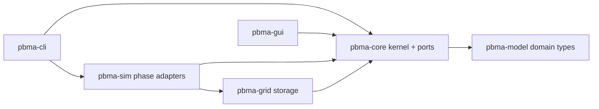
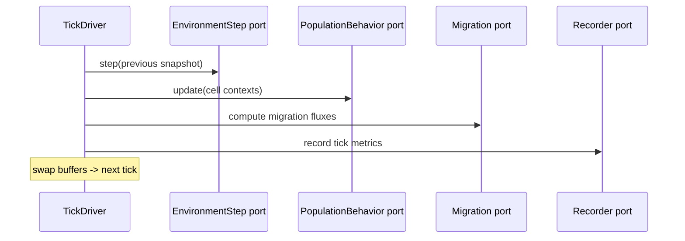

# PBMA Architecture

Framework for the bachelor thesis "A population-based multi-agent approach for simulating large-scale system dynamics in discrete environments". The framework is designed as a downstream-consumable product: external code (CLI, GUI, experiment scripts) builds on a stable kernel API instead of being entangled with it.

## Domain model (from the thesis)

- World = 2D grid of cells. Each cell holds an environment state (gas amounts O2, CO2, CH4, H2O, ..., temperature, light) and a set of species populations present in that cell.
- One agent == one species population in one cell (population-based, not individual-based). This is what makes "large-scale" tractable.
- Environment evolves as a cellular automaton: each cell's next state derives from its neighbors (e.g. gas diffusion = pressure equalization).
- Populations evolve: growth/decline per cell, migration fluxes between neighboring cells.
- Global feedback loops: species change the environment (Great Oxidation Event scenario); environment changes selection pressure on species.
- Later increments: species behavior is derived offline from AI (RL) and "pre-compiled" into cheap formulas evaluated at runtime.

## Crate layout

```
crates/
  pbma-model   pure domain types, no dependencies on other pbma crates
  pbma-core    kernel: World state, TickDriver, port traits, SpeciesRegistry, errors
  pbma-grid    grid cell management: coords, chunked dense storage, neighborhoods
  pbma-sim     default adapters: diffusion CA, population behavior, migration
runnables/
  pbma-cli     headless runner: config -> tick loop -> CSV metrics
  pbma-gui     visualization consuming kernel snapshot/telemetry APIs
```

Dependency direction (hexagonal / ports & adapters):



Rules:

- `pbma-model` depends on nothing pbma.
- `pbma-core` defines all ports (traits). It must not depend on `pbma-grid` or `pbma-sim`.
- Adapters (`pbma-grid`, `pbma-sim`) may depend on `core` and `model`, never the reverse.
- Runnables depend on everything and are the only place where concrete adapters get wired together.

## Kernel design

### Tick pipeline

`TickDriver` orchestrates one discrete tick. Phases are injected port implementations:



Ports in `pbma-core::ports`:

| Port | Purpose |
| --- | --- |
| `EnvironmentStep` | CA update rule for cell environment (default: gas diffusion) |
| `PopulationBehavior` | per-species population update (default: logistic-style growth; later: RL-derived formulas) |
| `MigrationPolicy` | computes per-tick migration fluxes between neighboring cells |
| `Rng` | deterministic, seedable randomness passed explicitly (no global state) |
| `Recorder` | telemetry sink (CSV rows, aggregates) |

### Species registry (slotmap)

`SlotMap<SpeciesKey, Species>` holds the global species table. Generational keys make speciation, extinction and later merging safe: a cell holding a stale key detects reuse instead of silently addressing the wrong species. Per-cell populations are `Vec<(SpeciesKey, Population)>` kept sorted by key for deterministic iteration and cheap merge.

Cells themselves are NOT slotmapped: the grid is static and dense, so plain indexed storage is faster and simpler. Slotmap is used exactly where entities have dynamic lifetimes (species).

### Determinism (hard requirement)

Large-scale runs must be reproducible, and determinism is what makes rayon parallelism safe:

1. Phases read an immutable previous-tick snapshot and write into private output buffers. No in-place mutation of data another phase reads.
2. Neighbor aggregation iterates neighbors in fixed index order (offset array, not runtime map iteration).
3. No `HashMap`/`HashSet` iteration anywhere in sim logic; if maps are needed, they are only keyed lookups.
4. All randomness comes from explicitly passed, seedable `Rng` instances derived per cell/chunk.
5. Floating point ops run per cell independently; cross-cell reductions happen in fixed order over sorted keys or chunk-sequential accumulation.

Enforced by tests: same seed + same config => identical metrics hash (golden trace).

## Grid and parallel execution

- `Grid<T>` in `pbma-grid`: linearized dense storage, fixed chunk size (64x64 target), `width/height` in cells.
- Neighborhoods: Von Neumann (4) and Moore (8), computed from chunk-local coords with explicit bounds handling at world edges.
- Double buffering: each tick reads the frozen previous snapshot and writes a fresh buffer, then swaps. Within a phase, work is split per chunk via rayon (`par_chunks_mut`), no shared mutable cell state.
- Migration: phases emit flux deltas into a per-tick flux buffer keyed by (target cell, species key); fluxes are applied in a separate apply step after computation. This is message-passing between cells without aliasing.
- Halo exchange / ghost cells are a later optimization; the first slice uses whole-world snapshot reads.

## Invariants

- Gas mass conservation under pure diffusion (property test).
- Population totals change only via behavior phase (birth/death) and migration phase (flux), never implicitly.
- Determinism as above.

## Decision log (ADR-style)

- ADR-1: multi-crate workspace, kernel + adapters split. Reason: downstream consumability, compiler-enforced dependency inversion.
- ADR-2: slotmap for species registry, dense arrays for cells. Reason: dynamic species lifetime vs static grid.
- ADR-3: phase-based tick pipeline with ports. Reason: swap sim rules (and later RL-derived behavior) without touching the kernel; testability.
- ADR-4: determinism-first parallelism (snapshot + flux buffers, fixed iteration order). Reason: reproducible science runs on many cores.
- ADR-5: CSV as the first recorder format. Reason: zero-dep, thesis-friendly analysis via any tool; binary formats later if needed.
